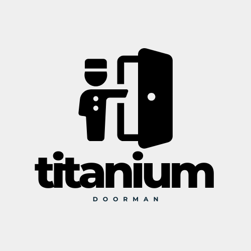

# TitaniumDoorman

  

Hardware-less doorbell for the [TiDB AgentX Hackathon](https://tidb-2025-hackathon.devpost.com). Visitors can scan a QR code → interact with an AI agent → resident gets notified via a text on their phone! No transformer, batteries, wires, or chime required. This makes it perfect for apartments, condos, or older homes. Best of all, it deploys with a single click with no coding or cloud experience required!

## Quick Deploy

**Prerequisites:**
- AWS Account with permissions for Lambda, API Gateway, SNS, S3, Secrets Manager, Bedrock
- TiDB Serverless cluster (get free at [tidbcloud.com](https://tidbcloud.com))

**Setup Steps:**
1. Create TiDB Serverless cluster at [tidbcloud.com](https://tidbcloud.com)
2. Click "Connect" → "Generate Password" → copy the connection string, which is in the tba next to the `Parameters` at on the connection modal.
3. Click "Deploy to AWS" button above
4. Enter your TiDB connection string and notification phone number (+12345678901 - include country code)
5. Deploy the stack (takes ~3 minutes)
6. Open the "QRCodeUrl" from stack outputs
7. Print the QR code page and post by your door!
8. Done! Visitors can now scan and interact with your virtual doorman

## How It Works

**Multi-Step Agentic AI Workflow:**

1. **Data Ingestion** → Visitor messages stored in TiDB with session tracking
2. **Historical Search** → Agent searches previous visits by name and intent patterns
3. **AI Classification** → Amazon Bedrock (Titan Text Express) analyzes message context
4. **AI Response Generation** → Personalized responses based on visitor history
5. **External Actions** → SMS notifications sent to resident with visit context

**Intelligence Features:**
- Recognizes returning visitors and personalizes responses
- Learns from historical visit patterns stored in TiDB
- Uses vector and full-text search for contextual awareness
- Fallback classification ensures reliability

## Architecture

- **API Gateway** - Public endpoints for visitor interactions
- **Lambda Functions** - Session management and AI agent orchestration  
- **TiDB Serverless** - Stores visits, transcripts with vector search
- **AWS Bedrock** - LLM for visitor intent classification
- **SNS** - Resident notifications